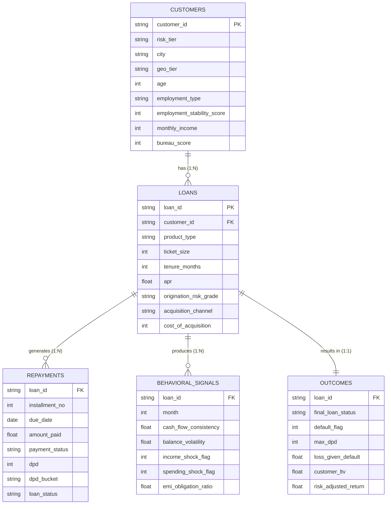

<div align="center">

# 📊 Digital Lending Portfolio Intelligence & Early Warning System

### CAC 2026 — Credit Analytics Project

[](https://www.python.org/)
[](https://scikit-learn.org/)
[](https://lightgbm.readthedocs.io/)
[](https://shap.readthedocs.io/)
[](https://streamlit.io/)
[](https://opensource.org/licenses/MIT)

> **End-to-end credit risk analytics pipeline** — from synthetic data generation and rigorous statistical EDA to a production-ready 30-day forward delinquency Early Warning System (EWS) and actionable credit policy recommendations, built for the Indian digital lending ecosystem.

</div>

---

## Table of Contents

- [1. Project Background](#1-project-background)
  - [1.1 Context & Motivation](#11-context--motivation)
  - [1.2 Objectives](#12-objectives)
  - [1.3 Tech Stack](#13-tech-stack)
  - [1.4 Repository Structure](#14-repository-structure)
- [2. Data Structure](#2-data-structure)
  - [2.1 Dataset Overview](#21-dataset-overview)
  - [2.2 Entity-Relationship Model](#22-entity-relationship-model)
  - [2.3 Table Descriptions](#23-table-descriptions)
  - [2.4 Real-World Properties Encoded](#24-real-world-properties-encoded)
- [3. Executive Summary](#3-executive-summary)
  - [3.1 Portfolio Risk & Segment Demographics](#31-portfolio-risk--segment-demographics)
  - [3.2 Key Portfolio Drivers & Insights](#32-key-portfolio-drivers--insights)
- [4. Delinquency Prediction Model (EWS)](#4-delinquency-prediction-model-ews)
  - [4.1 Problem Framing](#41-problem-framing)
  - [4.2 Feature Engineering](#42-feature-engineering)
  - [4.3 Model Architecture](#43-model-architecture)
  - [4.4 Performance Metrics](#44-performance-metrics)
  - [4.5 Risk Scorecard — GREEN / AMBER / RED](#45-risk-scorecard--green--amber--red)
  - [4.6 Intervention Framework](#46-intervention-framework)
- [5. Recommendations](#5-recommendations)
  - [5.1 Channel Rebalancing](#51-channel-rebalancing)
  - [5.2 Behavioral EWS Operationalisation](#52-behavioral-ews-operationalisation)
  - [5.3 Subprime Repricing & Thin-File Ladder](#53-subprime-repricing--thin-file-ladder)

---

## 1. Project Background

### 1.1 Context & Motivation

India's digital lending market has exploded in scale — fintech platforms, NBFCs, and neo-banking apps are disbursing millions of micro, small, and consumer loans through fully digital journeys. The Reserve Bank of India (RBI) has responded with comprehensive [Digital Lending Guidelines](https://www.rbi.org.in/) mandating fair pricing (APR disclosure), cooling-off periods, and enhanced borrower protection.

This project addresses a critical need for digital lenders: **how to build a data-driven credit intelligence framework** that simultaneously manages portfolio risk, optimises acquisition economics, and complies with evolving RBI regulations — all while maintaining profitability across diverse borrower segments.

### 1.2 Objectives

This project tackles **five strategic questions** that form the core of any digital lending portfolio management function:

| # | Strategic Question |
|---|---|
| **Q1** | Which customer segments exhibit materially different risk and repayment behaviours? |
| **Q2** | How do acquisition channels and onboarding strategies impact portfolio quality, LTV, and unit economics? |
| **Q3** | Which loan products, ticket sizes, and tenures deliver the strongest balance between growth and risk? |
| **Q4** | How can pricing, approval, or tenure strategies be tailored across segments to improve portfolio outcomes? |
| **Q5** | What performance metrics and views should senior leadership monitor to proactively manage risk and growth? |

Beyond the EDA, the project delivers a **30-day forward delinquency Early Warning System (EWS)** using gradient boosting, trained on behavioural signals that deteriorate 3 months before default — enabling proactive intervention before loans enter NPA.

### 1.3 Tech Stack

| Layer | Technology |
|---|---|
| **Language** | Python 3.10+ |
| **Data Processing** | Pandas, NumPy |
| **Statistical Analysis** | SciPy, Statsmodels |
| **Machine Learning** | LightGBM, scikit-learn |
| **Explainability** | SHAP (TreeExplainer) |
| **Visualisation** | Matplotlib, Seaborn |
| **Dashboards** | Streamlit, Plotly |
| **Reporting** | Markdown, HTML |

### 1.4 Repository Structure

```
📁 CAC 2026 Project/
│
├── 00_master_loans.csv              # Wide analysis table (loans + customers + outcomes)
├── 01_customers.csv                 # Customer profiles (50K records)
├── 02_loans.csv                     # Loan & product details (70K records)
├── 03_repayments.csv                # Monthly repayment events (~1.14M records)
├── 04_behavioral_signals.csv        # Monthly behavioral signals (~1.24M records)
|── 05_outcomes.csv                  # Loan-level outcomes & LTV (70K records)
│
├── generate_lending_data.py             # Synthetic dataset generator
├── Q&A.py                               # Problem-statement visualisations
├── Model.py                             # Delinquency prediction model (LightGBM v2.0)
├── Dashboard.py                         # Streamlit interactive portfolio dashboard
├── Strategic_Portfolio_Intelligence_Report.md  # Synthesised findings & leadership answers
├── C_A_Project.pdf                       # Project report
```

---

## 2. Data Structure

### 2.1 Dataset Overview

The project uses a **synthetic but India-realistic** digital lending dataset designed to mirror the statistical properties, correlations, and edge cases found in production lending portfolios.

| File | Records | Columns | Description |
|---|---|---|---|
| `01_customers.csv` | 50,000 | 14 | Customer demographic and credit profiles |
| `02_loans.csv` | 70,000 | 14 | Loan product, pricing, and origination details |
| `03_repayments.csv` | ~1,144,062 | 12 | Monthly repayment events with DPD tracking |
| `04_behavioral_signals.csv` | ~1,236,752 | 10 | Monthly bank-account behavioral signals per loan |
| `05_outcomes.csv` | 70,000 | 11 | Loan-level outcomes, LTV, and profitability |
| `00_master_loans.csv` | 70,000 | 34 | Pre-joined wide table for rapid analysis |

> **Scale:** 50,000 unique customers across 70,000 loans (~28% are repeat borrowers), with over 2.3 million granular monthly records spanning Jan 2021 – Jun 2024.

### 2.2 Entity-Relationship Model



### 2.3 Table Descriptions

#### `01_customers.csv` — Borrower Profiles

Contains demographic, employment, credit bureau, and KYC information for 50,000 customers stratified across four risk tiers:

- **Prime (28%)** — Salaried-Govt/Private, high bureau scores (~730), stable income
- **Near-Prime (37%)** — Mixed employment, moderate bureau scores (~650)
- **Subprime (25%)** — Gig/Daily-Wage workers, lower bureau scores (~560)
- **Thin-File (10%)** — New-to-Credit (NTC), zero bureau history, alternative data dependent

#### `02_loans.csv` — Loan & Product Details

Captures product type, pricing (APR), ticket size, tenure, acquisition channel, and cooling-off exit status for 70,000 loans across 6 product types: Personal Loan, SME Working Capital, BNPL, Two-Wheeler Loan, Consumer Durable, and Education Loan.

#### `03_repayments.csv` — Monthly Payment Events

Granular installment-level records tracking payment status (`Paid-On-Time`, `Late-1-30`, `Late-31-60`, `Partial`, `Missed`), DPD, RBI bucket classification (`Current` → `DPD_90+`), and loan status (`Standard` → `SMA-1` → `SMA-2` → `NPA` → `Defaulted`).

#### `04_behavioral_signals.csv` — Bank-Account Behavioral Signals

Monthly signals including cash flow consistency, balance volatility, income/spending shock flags, FOIR (EMI obligation ratio), and active loan account count. **These signals deteriorate 3 months before default** — the foundation of the EWS model.

#### `05_outcomes.csv` — Loan-Level Outcomes

Final loan status, default flag, recovery amounts, Loss Given Default (LGD), Customer Lifetime Value (LTV), Risk-Adjusted Return (RAR), and profitability flag.

### 2.4 Real-World Properties Encoded

The synthetic data was carefully designed to encode realistic statistical properties observed in Indian digital lending:

| Property | Design Choice |
|---|---|
| **Risk-income correlation** | Lower-tier customers have lower incomes, lower bureau scores, and less stable employment — all correlated, not random |
| **Channel quality effect** | Paid-Digital and DSA channels carry a 1.25–1.30× PD multiplier vs. Referral/Organic at 0.70–0.75× |
| **Stress precedes default** | Payment deterioration is modelled 3 months before default, making the EWS realistic and predictive |
| **Festival seasonality** | Oct/Nov (Diwali) and Apr (harvest) months show +6% better on-time repayment rates |
| **Geography-income interaction** | Metro incomes are 1.4–1.6× Tier-3 incomes for the same risk tier |
| **APR structure** | Base rate + risk premium by tier + channel pricing noise — reflects realistic risk-based pricing |
| **LGD range** | 25–65% recovery rates reflect realistic Indian digital lending recovery experience |
| **Product-employment fit** | SME loans are biased toward Self-Employed-Business; BNPL toward Gig-Workers and lower-income segments |

---

## 3. Executive Summary

A comprehensive portfolio analysis was conducted across 50,000 customers and 70,000 loans (covering Jan 2021 – Jun 2024), backed by statistical tests (Kruskal-Wallis, Chi-Square, Information Value, and Spearman correlation). The analysis revealed critical insights regarding customer segmentation, acquisition economics, product risk, and seasonality:

### 3.1 Portfolio Risk & Segment Demographics

The lending portfolio is stratified into four distinct risk tiers. While **Prime** borrowers exhibit low defaults (3.1%), they carry larger ticket sizes and high absolute Loss Given Default (LGD). **Near-Prime** represents the portfolio's highest Risk-Adjusted Return (RAR = 0.200). **Subprime** borrowers show high defaults (20.2%) and steep pre-default cash-flow deterioration. **Thin-File (NTC)** borrowers present a strategic growth opportunity, with behavioural signals serving as highly predictive credit underwriting alternatives.

| Segment | Volume (Loans) | Share | Default Rate (30+ DPD) | Avg Income (₹) | Bureau Score | Profitable Loans | Avg LTV (₹) |
|---|---|---|---|---|---|---|---|
| **Prime** | 18,809 | 26.9% | **3.1%** | 1,03,691 | 729 | 78.2% | 43,869 |
| **Near-Prime** | 24,919 | 35.6% | 11.0% | 51,217 | 649 | 74.2% | 31,521 |
| **Subprime** | 16,034 | 22.9% | **20.2%** | 26,896 | 559 | 64.2% | 19,031 |
| **Thin-File** | 6,599 | 9.4% | 15.4% | 22,100 | 0 | 64.2% | 15,281 |

*Note: Employment Type (Cramer's V = 0.5997) is the strongest predictor of default outside bureau scores. Conversely, geography (Geo Tier) has virtually no predictive power (IV = 0.0001) for repayment default.*

### 3.2 Key Portfolio Drivers & Insights

- **The CAC-Risk Paradox:** Paid-Digital and DSA-Agent channels account for **48% of loan volume** but exhibit the highest Customer Cost of Acquisition (CAC) (up to ₹2,310) and highest default risk. In contrast, Referral and Organic-App channels deliver the lowest CAC (₹420–₹630) and the lowest risk. Onboarding KYC type has no statistically significant correlation with default rate (Cramer's V = 0.002).
- **Product Growth-Risk Fit:** Two-Wheeler and Consumer-Durable loans show the highest risk-adjusted margins, making them prime candidates for aggressive growth. SME Working Capital loans exhibit high tail-risk and ticket skewness, requiring tight cash-flow verification. Personal Loans underperformed when originating from subprime segments or high-CAC channels.
- **Pricing Discrepancies:** Grade D (Thin-File) is structurally underpriced relative to its risk profile (15.4% default rate priced at a median APR of 20.69%, compared to Near-Prime Grade C+ at 16.8% default priced at 22.83% APR).
- **Seasonality Effects:** Portfolio repayment follows distinct patterns. October, November (Diwali), and April show a **+5.9 percentage point increase** in on-time repayment rates, while the post-holiday period (January–March) experiences higher delinquency rates.

---

## 4. Delinquency Prediction Model (EWS)

### 4.1 Problem Framing

The model predicts a **binary target**: whether a currently performing or mildly delinquent loan (Current or DPD 1–30) will cross **30+ DPD within the next 30 days**. This framing is specifically designed for the Early Warning System use case — flagging loans *before* they enter NPA territory, when proactive intervention can still prevent default.

```
Target: will_go_dpd30_next_30_days
  → 1  if a performing/mildly-delinquent loan will cross 30+ DPD in the next installment
  → 0  otherwise

Observation panel: 823,543 loan-month observations (5.92% positive rate)
```

### 4.2 Feature Engineering

The model uses **39 engineered features** across three categories:

| Category | Features | Role |
|---|---|---|
| **Repayment Behavioral** (13 features) | `missed_payment_last_3m`, `dpd_trend_slope`, `payment_ratio_last_month`, `sma_encoded`, `sma_trend`, `is_festival_month`, etc. | Direct observation of payment trajectory |
| **Bank Behavioral** (11 features) | `rolling_30d_balance_volatility`, `cash_flow_trend`, `min_cash_flow_3m`, `both_shocks_flag`, `inflow_trend`, `volatility_acceleration`, etc. | Leading indicators of financial stress (deteriorate 1–3 months *before* payment behaviour) |
| **Origination / Static** (15 features) | `bureau_score`, `monthly_income`, `employment_stability_score`, `risk_tier_encoded`, `channel_risk_score`, `emi_to_income_ratio`, etc. | Baseline credit quality determining sensitivity to shocks |

> **Key design choice:** Features are computed over a **3-month rolling window** because stress signals appear ~3 months before default (validated in the Executive Summary).

### 4.3 Model Architecture

| Component | Details |
|---|---|
| **Algorithm** | LightGBM (Light Gradient Boosting Machine) |
| **Why LightGBM** | 20–50× faster training than sklearn GBM via histogram-based splits; leaf-wise growth for lower loss per tree; native class-imbalance handling (`is_unbalance=True`); SHAP TreeExplainer compatibility |
| **Key Hyperparameters** | `n_estimators=500`, `learning_rate=0.05`, `num_leaves=63`, `min_child_samples=50`, `feature_fraction=0.80`, `bagging_fraction=0.80` |
| **Threshold Selection** | Youden's J statistic on validation set — maximises TPR − FPR trade-off |
| **Train/Test Split** | 80/20 stratified split (658,834 train / 164,709 test) |
| **Class Imbalance** | Handled natively via LightGBM's `is_unbalance=True` |
| **Explainability** | Full SHAP TreeExplainer on entire test set |

### 4.4 Performance Metrics

| Metric | Train | Test | Interpretation |
|---|---|---|---|
| **AUC-ROC** | 0.6349 | **0.6186** | Moderate discriminatory power |
| **Gini Coefficient** | — | **23.73%** | Moderate — suitable for EWS |
| **KS Statistic** | — | **16.61%** | Population separation validated (p < 10⁻²²¹) |
| **Train-Test AUC Gap** | — | **0.0163** | Acceptable — no overfitting |

**Classification Performance (at Youden's J threshold):**

| Class | Precision | Recall | F1-Score |
|---|---|---|---|
| Non-Delinquent | 0.9502 | 0.7814 | 0.8576 |
| **Will-Delinquent** | 0.0915 | **0.3496** | 0.1450 |

> **Operational interpretation:** The model catches **35% of all loans that will genuinely go 30+ DPD**, at a false-alarm rate of 21.9%. In a collections context, this means for every 100 loans flagged, ~9 truly go delinquent — a manageable false-positive cost given that the average LGD avoidance is ₹28,647.

#### Top Features by SHAP Importance

| Rank | Feature | Category | Direction |
|---|---|---|---|
| 1 | `employment_stability_score` | Origination | ↓ Risk (higher stability = lower risk) |
| 2 | `months_since_origination` | Origination | Dynamic (risk changes with loan age) |
| 3 | `employment_risk` | Origination | ↑ Risk |
| 4 | `min_cash_flow_3m` | Bank Behavioral | ↓ Risk (higher consistency = lower risk) |
| 5 | `tenure_months` | Origination | ↓ Risk |
| 6 | `apr` | Origination | ↑ Risk (higher APR = riskier borrower) |
| 7 | `risk_tier_encoded` | Origination | ↑ Risk |
| 8 | `rolling_30d_balance_volatility` | Bank Behavioral | ↑ Risk |
| 9 | `cash_flow_trend` | Bank Behavioral | ↓ Risk |
| 10 | `grade_encoded` | Origination | ↑ Risk |

### 4.5 Risk Scorecard — GREEN / AMBER / RED

The model's predicted probabilities are mapped to three actionable risk buckets:

| Bucket | Threshold | Loans | Share | Actual Delinquency Rate | Catch Rate |
|---|---|---|---|---|---|
| 🟢 **GREEN** | P < 0.15 | 320 | 0.8% | **0.00%** | 0.0% |
| 🟡 **AMBER** | 0.15 ≤ P < 0.40 | 12,808 | 31.4% | **2.25%** | 10.6% |
| 🔴 **RED** | P ≥ 0.40 | 27,713 | 67.9% | **8.74%** | **89.4%** |

> **Amber + Red cumulative catch rate = 100%** — the scorecard captures all delinquencies across the two intervention buckets.

#### Delinquency Rate by Risk Tier × Risk Bucket

| Risk Tier | 🟡 AMBER | 🟢 GREEN | 🔴 RED |
|---|---|---|---|
| Prime | 2.88% | 0.0% | 6.64% |
| Near-Prime | 2.04% | 0.0% | 8.54% |
| Subprime | 0.26% | 0.0% | **10.43%** |
| Thin-File | 0.00% | 0.0% | 9.50% |

### 4.6 Intervention Framework

| Bucket | Primary Action | Contact Mode | Urgency |
|---|---|---|---|
| 🟢 **GREEN** | Monthly auto-debit confirmation; cross-sell eligibility check | Digital only | Routine |
| 🟡 **AMBER** | Proactive WhatsApp/SMS reminder 7 days before due date; IVR call 3 days before; offer EMI restructuring | Digital + 1 call | **HIGH — act in 7 days** |
| 🔴 **RED** | Immediate collections call within 24 hours; restructuring/settlement offer; legal notice preparation | Direct call + field visit (if ticket > ₹50K) | **CRITICAL — act in 24 hours** |

---

## 5. Recommendations

### 5.1 Channel Rebalancing

**The single highest-impact lever for portfolio improvement.**

| Action | Impact |
|---|---|
| Shift 10% of volume from Paid-Digital → Referral/Organic | Saves ~₹1,890 CAC per loan |
| Reduced underlying PD by ~2–3 percentage points | Lower expected credit losses |
| Apply channel-specific APR adjustments | +75–100 bps for Paid-Digital; +50–75 bps for DSA-Agent |
| **Estimated net portfolio ROE improvement** | **150–200 bps** |

**Recommended channel APR adjustments:**

| Channel | APR Adjustment (bps above base) |
|---|---|
| Referral | 0 (base rate) |
| Organic-App | +10–20 bps |
| Corporate / Bank-Partnership | +20–30 bps |
| DSA-Agent | **+50–75 bps** |
| Paid-Digital | **+75–100 bps** |

### 5.2 Behavioral EWS Operationalisation

**Deploy the 3-month pre-default signal window into production collections.**

| Component | Detail |
|---|---|
| **Leading signals** | Cash Flow Consistency (CFC), Balance Volatility (BV), FOIR |
| **Highest-confidence trigger** | Co-occurrence of income shock AND spending shock in the same month (0.97% of loan-months, but near-certain default predictor) |
| **Catch rate** | 35% of delinquencies caught before DPD 30 (model recall) |
| **Expected LGD avoidance** | ~₹28,647 × catch rate × volume |
| **Target improvement** | AUC > 0.70 with full behavioural feature engineering and expanded training data |

**Escalation rule:** If a loan shows 2+ consecutive months of declining CFC + rising BV + FOIR crossing 0.50, trigger immediate intervention regardless of model bucket.

### 5.3 Subprime Repricing & Thin-File Ladder

**Correct the under-pricing of Grade D and create a graduation pathway for NTC customers.**

| Action | Detail |
|---|---|
| **Raise Grade D APR** | +150–200 bps to correct structural under-pricing (15.4% default rate priced as if 10%) |
| **BNPL → Consumer-Durable → Personal Loan ladder** | Start NTC customers with ₹10K–₹30K BNPL, graduate to larger products based on repayment behaviour |
| **Behavioural-score-based dynamic pricing** | GREEN bucket customers receive APR reductions as loyalty lever; RED bucket receives immediate repricing or restructuring |
| **Goal** | Convert Thin-File (15.4% default) to Near-Prime through behavioural data accumulation |

--- 

<div align="center">

**Built for CAC 2026 — Credit Analytics Challenge**


</div>
